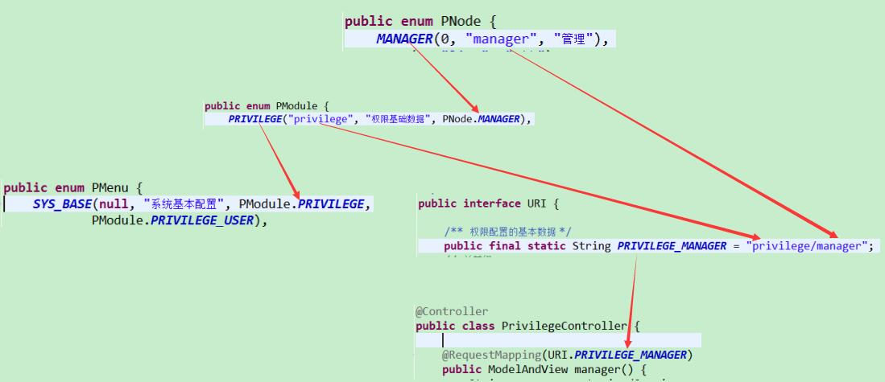
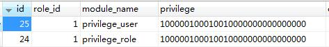
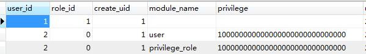
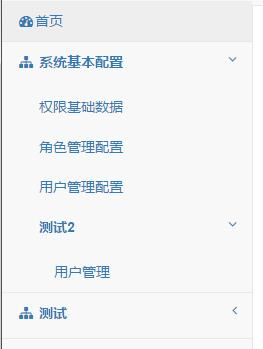

#privilege_权限控制设计思路

> 本文档主要是简单描述下权限控制的主要部分。 
> **用户 super 拥有所有的权限**，代码上有判断当前登录用户帐号。 

## 基本脉络
>主要分成5个部分。

1.  三个权限基础数据对象和URI
2.  组织基础数据对象
3.  角色、用户的权限表
4.  角色、用户的权限数据(用于访问控制、给其它用户配置权限)
5.  基于用户的权限数据生成有层级的访问菜单

## 分解

### 1. 三个权限基础数据对象和URI

包含 **URI.java，PNode.java， PModule.java， PMenu.java** 对象
> URI: 字面意思，所有Controller的@RequestMapping的value都在此对象定义。 
> PNode： 定义最细粒度的权限控制节点，也能起到聚合控制的作用。 
> PModule: 定义模块和模块下拥有的多个PNode节点。 
> PMenu: 定义访问菜单。聚合PModule定义的模块到菜单下。初步形成有层级的访问菜单。

彼此关联：

### 2. 组织基础数据对象
依据PMenu的配置代码，生成树形菜单的数据结构。
#### Menu.java

	public class Menu {
	
		private int id; 		// 当前ID PMenu.ordinal() + 1;
		private int pid = 0; 	// 父id PMenu.ordinal() + 1
		private String name; 	// 菜单名称
		private List<Module> moduleList = new ArrayList<>();	// 模块列表
		private List<Menu> subList = new ArrayList<>();		// 子菜单列表
	}

#### Module.java

	public class Module {

		private final int id;	// PModule.ordinal() + 100;
		private final int pid;	// Menu实例的id
		
		private final String pname;	// 模块的值、名称
		private final String desc;	
		private final List<PNode> nodeList = new ArrayList<>();	// 节点列表
	}

结合以上两数据对象，生成层级菜单（`List<Menu>`）,供权限配置。 
前端的层级展示采用 [jquery-treegrid](http://maxazan.github.io/jquery-treegrid/) .
#### `List<Menu>` 数据结构示例

	[{
		"id": 1,
		"pid": 0,
		"name": "系统基本配置",
		"moduleList": [{
			"id": 101,
			"pid": 1,
			"pname": "privilege_role",
			"desc": "角色管理配置",
			"nodeList": ["MANAGER",
			"NEW",
			"GET",
			"EDIT"]
		},
		{
			"id": 102,
			"pid": 1,
			"pname": "privilege_user",
			"desc": "用户管理配置",
			"nodeList": ["MANAGER",
			"NEW",
			"GET",
			"EDIT"]
		}],
		"subList": []
	}]

### 3. 角色、用户的权限和表

> 1. 模块的权限表示，这里采用 **索引字符** 表示法。"10000000"的权限字符串，表示只有模块的PNode.MANAGER节点的访问、操作权限。(**PNode.index** 即是索引)
> 2. 权限表只有模块和模块的权限数据，没有菜单结构的数据。 
 *所以需要通过权限的模块，倒序生成出用户的访问菜单，后面会涉及。*

先看表数据：
##### 角色权限表数据
  

表结构比较简单，只有模块名、角色拥有的权限。

##### 用户权限表数据
 

表结构同样只有模块名、角色拥有的权限。不过此表数据分两种情况： 
> 1. role_id > 0：表示基于角色给用户配置了权限。用户的权限数据直接定位到角色的权限数据。 
> 2. role_id==0: 表示此表里 **`user_id`** 指定的，即是用户的权限数据。

### 4. 角色、用户的权限数据(用于访问控制、给其它用户配置权限)

1. 用户可访问的模块和模块的节点，由权限数据表示。
2. 用户给其它用户配置的权限数据在自己的权限数据范围内。

##### 用于访问控制的权限数据

> 1. 生成：  
  	读取用户权限表数据-->对照PModule的定义将权限的字符表示转化为节点值列表。
> 2. 控制： 见 `MySecurityPrivilegeFilter` 的实现。有在 `web.xml` 配置此Filter。
> 3. 结构： 
	
	List<Map<String, List<String>>>   // List<Map<PModule.pname, List<PNode.pname>>>
	
	数据示例(json)：
	[{
		"privilege_role": ["manager",
		"new",
		"get",
		"edit"]
	},
	{
		"privilege_user": ["manager",
		"new"]
	}]

##### 给其它用户配置权限的权限数据

###### 1. 生成： 

基于用户的【访问控制的权限数据】（`List<Map<String, List<String>>>`）进一步生成有结构的菜单（**`List<Menu>`**）。

###### 2. 实现： 

见 `PrivilegeService`。用户登录成功时加载，仅加载一次，并加到Session属性。加载见：  `MyAuthenticationSuccessHandler` 对象。

###### 3. 数据结构范例：

	[{
		"id": 1,
		"pid": 0,
		"name": "系统基本配置",
		"moduleList": [{
			"id": 101,
			"pid": 1,
			"pname": "privilege_role",
			"desc": "角色管理配置",
			"nodeList": ["MANAGER",
			"NEW",
			"GET",
			"EDIT"]
		},
		{
			"id": 102,
			"pid": 1,
			"pname": "privilege_user",
			"desc": "用户管理配置",
			"nodeList": ["MANAGER",
			"NEW",
			"GET",
			"EDIT"]
		}],
		"subList": []
	}]

### 5. 基于用户的权限数据生成层级访问菜单

###### 1. 生成： 
基于用户的【访问控制的权限数据】（`List<Map<String, List<String>>>`）,
结合PMenu的菜单与子菜单定义，由模块值逆序找到模块、找到拥有此模块的菜单、继续找父菜单。生成用于访问的树形菜单（**`List<AccessMenu>`**）。

###### 2. 层级菜单的数据对象：

AccessMenu：

	public class AccessMenu {
		
		private final String desc;
		private final List<AccessModule> moduleList = new ArrayList<>();
		private final List<AccessMenu> subMenuList = new ArrayList<>();
	}

AccessModule:

	public class AccessModule {
	
		private final String desc;
		private final String uri;
	}

###### 3. 代码实现： 

	见 PrivilegeService.mineAccessMenu()

###### 4. 数据结构范例：

	[{
		"desc": "系统基本配置",
		"moduleList": [{
			"desc": "权限基础数据",
			"uri": "/hs/privilege/manager"
		},
		{
			"desc": "角色管理配置",
			"uri": "/hs/privilege_role/manager"
		},
		{
			"desc": "用户管理配置",
			"uri": "/hs/privilege_user/manager"
		}],
		"subMenuList": [{
			"desc": "测试2",
			"moduleList": [{
				"desc": "用户管理",
				"uri": "/hs/user/manager"
			}],
			"subMenuList": []
		}]
	},
	{
		"desc": "测试",
		"moduleList": [{
			"desc": "用户管理配置",
			"uri": "/hs/privilege_user/manager"
		}],
		"subMenuList": []
	}]

其中 subMenuList 有值，现在暂时只支持一层子菜单。有需要再考虑完善。
上面数据的效果图：

 
